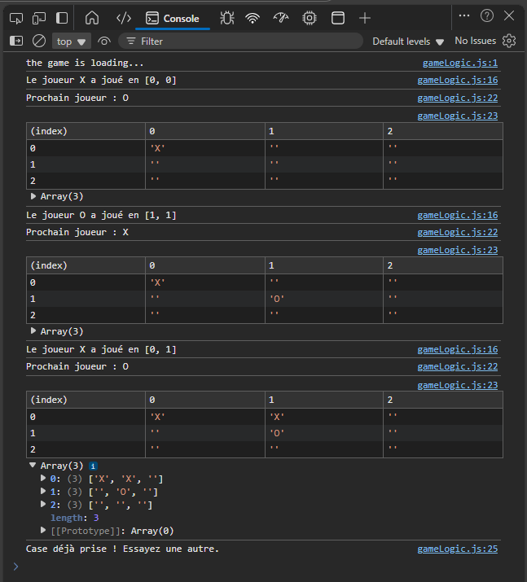

# Jeu de Morpion Dynamique en JavaScript

Ce projet est une implémentation d'un jeu de Morpion (Tic Tac Toe) dynamique et configurable, développé en JavaScript vanilla, HTML5 et CSS3. Il a été réalisé dans le cadre d'un cas pratique simulant une demande de l'entreprise PlayInnovate. L'application permet de personnaliser la taille de la grille (n x n) et le nombre de symboles à aligner pour gagner (k), tout en offrant une expérience utilisateur moderne et responsive.

➡️ Accéder à la démo en ligne (Pensez à héberger votre projet sur GitHub Pages ou un service similaire et à mettre le lien ici)



## Table des matières

- [Contexte du Projet](#contexte-du-projet)
- [Fonctionnalités Principales](#fonctionnalités-principales)
- [Technologies et Outils](#technologies-et-outils)
- [Installation et Lancement](#installation-et-lancement)
- [Structure du Projet](#structure-du-projet)
- [Planification et Gestion](#planification-et-gestion)
- [Critères de performance respectés](#critères-de-performance-respectés)
- [Auteur](#auteur)

## Contexte du Projet

L'entreprise fictive PlayInnovate, une start-up spécialisée dans le gaming en ligne, souhaitait enrichir son catalogue avec un jeu de Tic Tac Toe évolutif. L'objectif était de dépasser la version classique en offrant aux joueurs la possibilité de configurer leurs propres règles (taille de la grille et condition de victoire) pour une expérience plus flexible et engageante.

## Fonctionnalités Principales

- **Grille de jeu 100% configurable** : Les joueurs peuvent choisir la taille de la grille (n x n) avant de commencer.

- **Condition de victoire adaptable** : Le nombre de symboles à aligner pour gagner (k) est également personnalisable.

- **Logique de jeu pour deux joueurs** : Le joueur 1 (X) commence, puis les tours alternent.

- **Détection automatique du vainqueur** : L'algorithme vérifie les alignements horizontaux, verticaux et sur les deux diagonales.

- **Gestion des matchs nuls** : Le jeu déclare une égalité si la grille est remplie sans qu'un vainqueur ne soit désigné.

- **Persistance des données** : Les scores ainsi que les préférences de jeu (n, k, symboles des joueurs) sont sauvegardés dans le localStorage du navigateur.

- **Interface intuitive** :
  - Affichage clair du joueur dont c'est le tour.
  - Mise en surbrillance de la ligne gagnante.
  - Un bouton pour recommencer une partie avec les mêmes paramètres.
  - Un bouton pour réinitialiser les scores.

- **Menu de paramètres complet** : Permet aux joueurs de choisir leurs symboles (par exemple, 🔱 et 🔥) et de configurer n et k.

- **Design Responsive** : L'interface est conçue pour être fluide et agréable sur ordinateur, tablette et mobile.

## Technologies et Outils

- **HTML5** : Utilisé pour une structure sémantique et accessible.

- **CSS3** : Pour le design moderne, les animations et la responsivité (via Flexbox/Grid).

- **JavaScript (Vanilla)** : L'ensemble de la logique de jeu, la manipulation du DOM et la gestion des événements sont codés sans aucun framework.

## Installation et Lancement

Ce projet ne nécessite aucune dépendance ou étape de compilation.

1. Clonez ce dépôt sur votre machine locale :

```bash
git clone https://github.com/Drissnafii/AlphaGo-Tic-Tac-Toe.git
```

2. Naviguez jusqu'au dossier du projet :

```bash
cd AlphaGo-Tic-Tac-Toe.git
```

3. Ouvrez le fichier `index.html` directement dans votre navigateur web.

## Structure du Projet

L'arborescence des fichiers a été pensée pour une organisation claire et une séparation des préoccupations (HTML/CSS/JS), facilitant la maintenance et la compréhension du code.

```
├── index.html                # Fichier principal de la structure HTML
├── assets/
│   ├── css/
│   │   └── style.css         # Styles de l'application
│   └── js/
│       ├── main.js           # Script principal (gestion des événements, initialisation)
│       ├── gameLogic.js      # Module pour la logique du jeu (vérification victoire, etc.)
│       └── ui.js             # Module pour la manipulation de l'interface (DOM)
│
└── README.md                 # Documentation du projet
```

## Planification et Gestion

La planification des tâches, le suivi des fonctionnalités et la gestion du temps ont été réalisés à l'aide de JIRA.

➡️ Accéder au tableau de planification JIRA

## Critères de performance respectés

- **Manipulation du DOM** : L'interface est entièrement générée et mise à jour dynamiquement en JavaScript.

- **Stockage local (localStorage)** : Utilisé efficacement pour la persistance des scores et des préférences.

- **Structure HTML sémantique** : Utilisation de balises appropriées pour une meilleure accessibilité et un meilleur référencement.

- **Modularité du code** : Le code JavaScript est structuré en fonctions et modules distincts pour la logique, l'interface et la gestion des données.

- **Bonnes pratiques (Clean Code)** : Respect des conventions de nommage (camelCase pour JS), code commenté et aéré pour une lisibilité optimale.